# FlowGate

### An AI-Native, Rule-Engine Approval Workflow Platform for the Enterprise

> *One platform. Every approval. Every system. Powered by rules, accelerated by AI.*

**Author:** Product Management, CompanyZ
**Status:** Idea Paper (v0.1)
**Audience:** Executives, Design Partners, Engineering Leadership

---

## 1. The Problem in One Picture

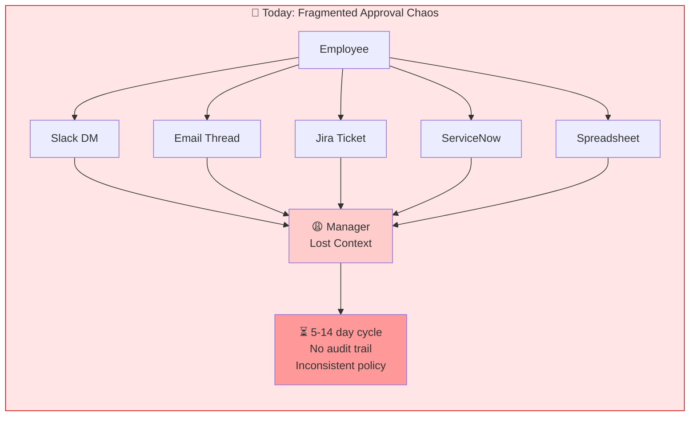

```mermaid
flowchart LR
    subgraph TOMORROW["🟢 With FlowGate: One Pipeline, Many Categories"]
        U[Employee] --> FG{{FlowGate}}
        FG --> AI[🤖 AI Copilot<br/>auto-fills + routes]
        AI --> RE[⚙️ Rule Engine<br/>policy-as-code]
        RE --> MCP[🔌 MCP Connectors<br/>act on real systems]
        MCP --> ✅[Approved & Provisioned<br/>< 1 hour median]
    end

    style TOMORROW fill:#e5ffe5,stroke:#0a0
    style ✅ fill:#99ff99
```

---

## 2. Product Vision

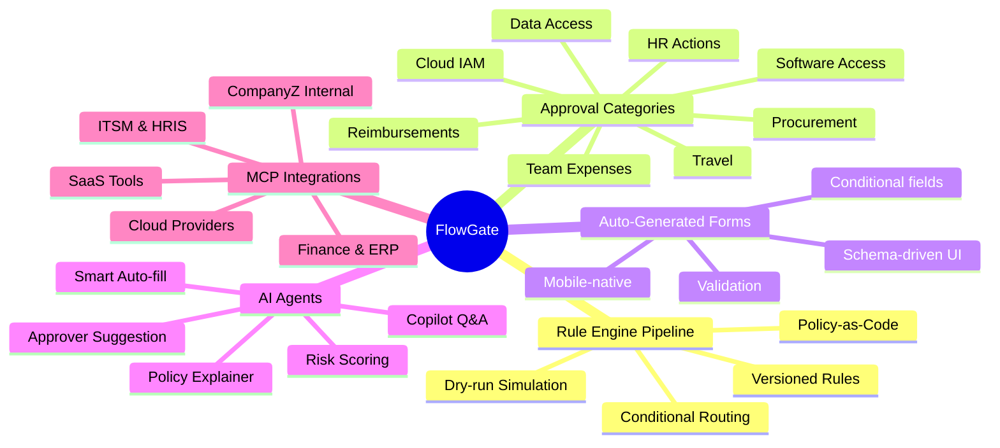

---

## 3. High-Level Architecture

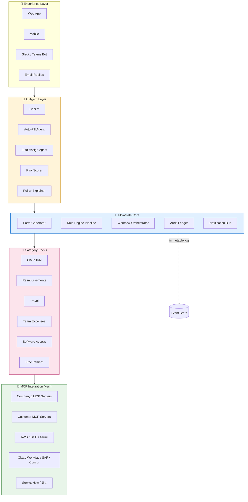

---

## 4. The Rule Engine Pipeline (Core Differentiator)

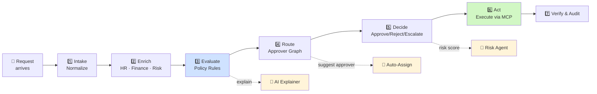

### Rule Anatomy (Policy-as-Code)

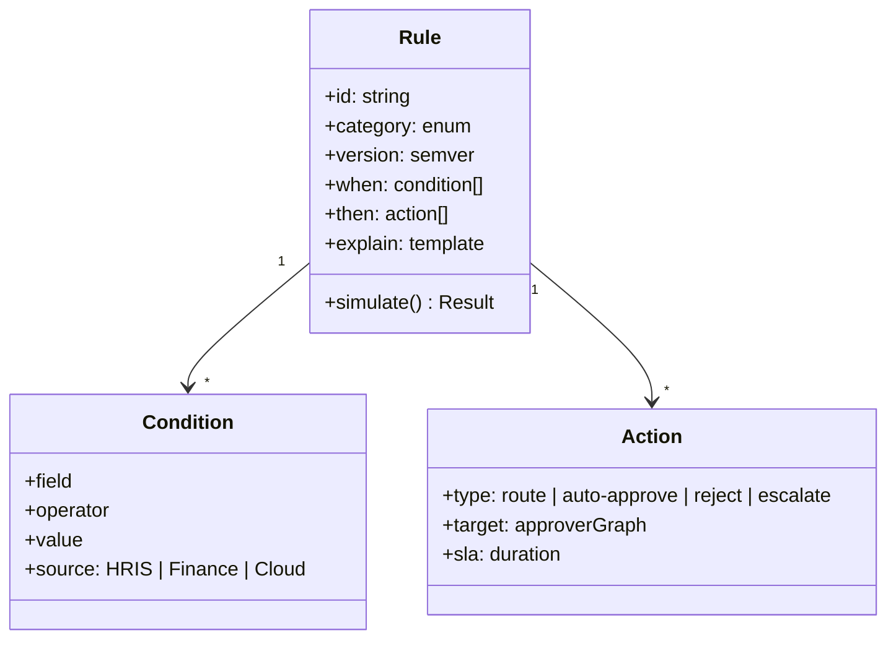

---

## 5. Approval Category Taxonomy

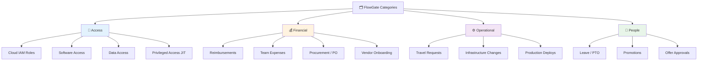

Each category ships as a **Category Pack**: pre-built rules, form schema, MCP connectors, and approver-graph templates that customers can clone and customize.

---

## 6. End-User Journey

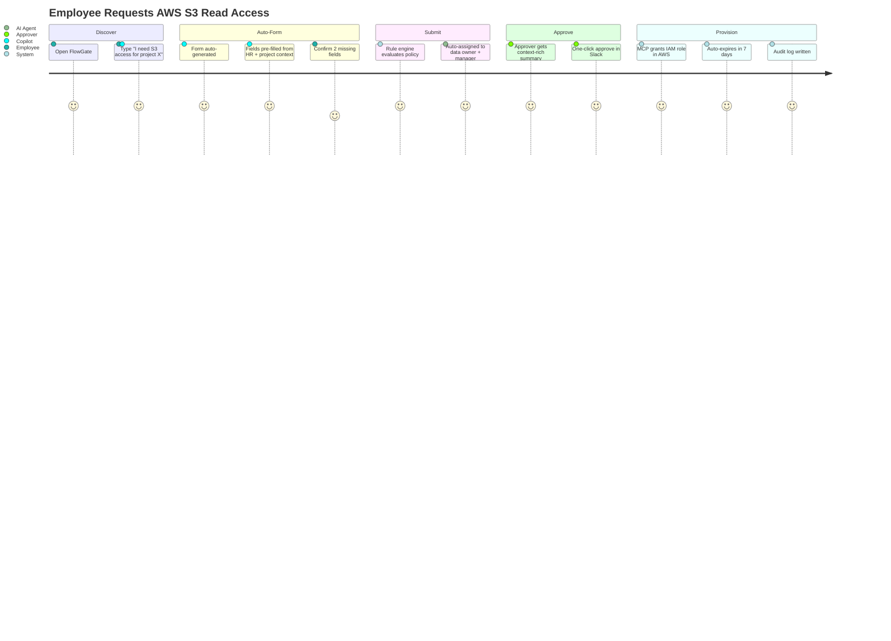

### Side-by-Side: Today vs FlowGate

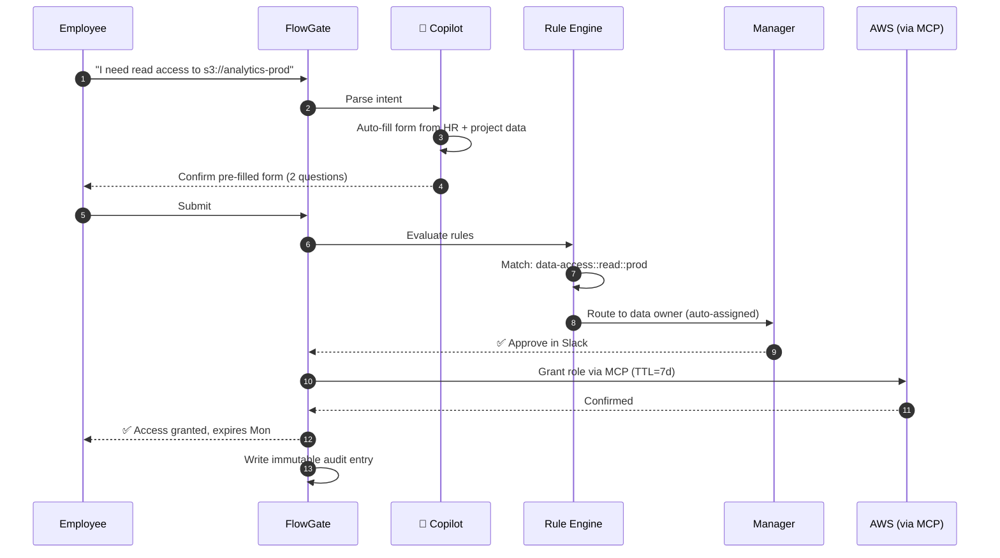

---

## 7. AI Agents — Where They Plug In

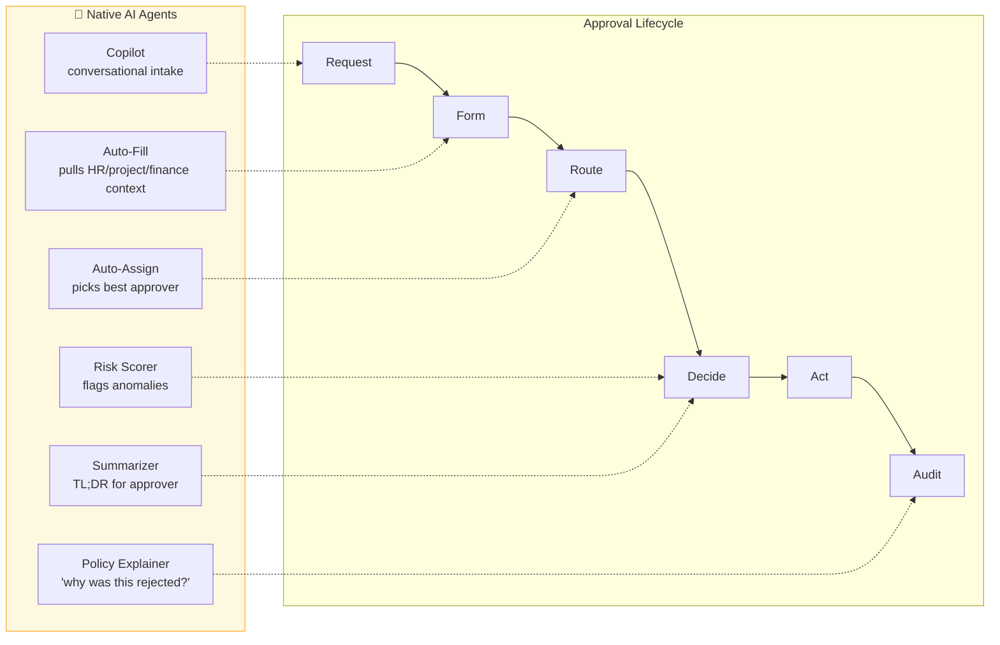

### Approver's-Eye View (AI-summarized card)

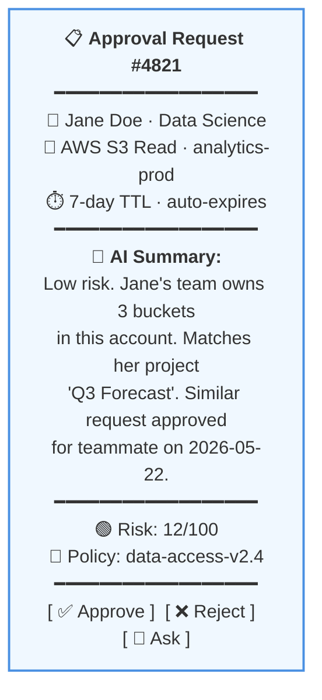

---

## 8. Auto Form Generation

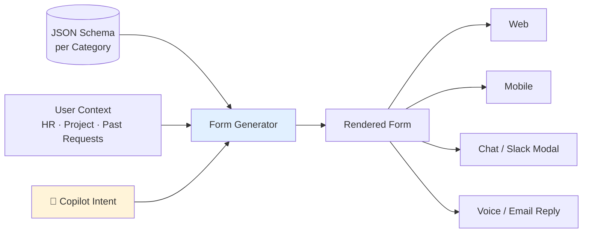

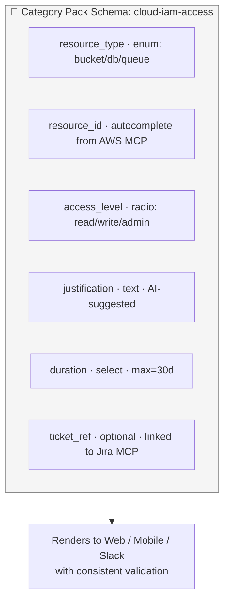

---

## 9. Decision Tree (Sample: Reimbursement)

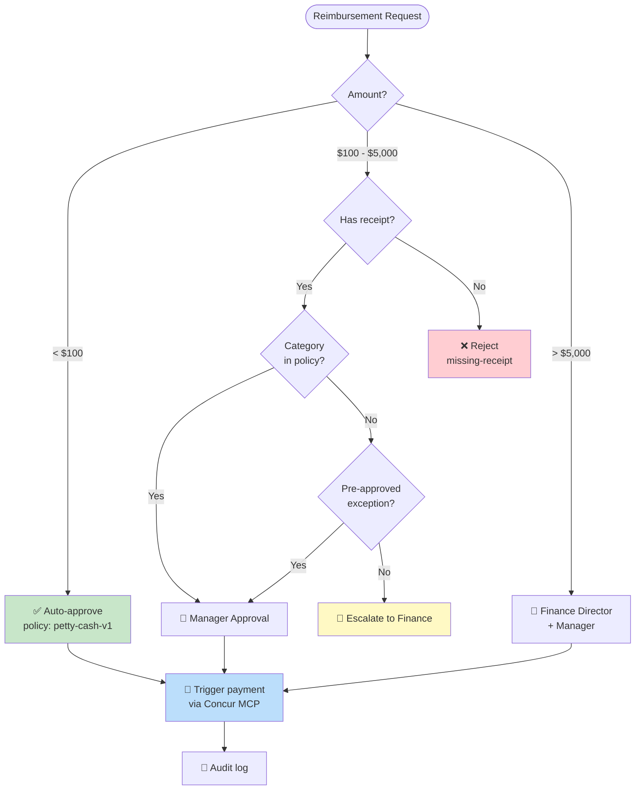

---

## 10. Data Flow & Architecture

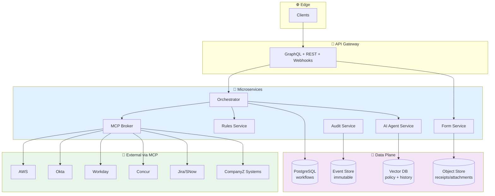

### Event-Driven Data Flow

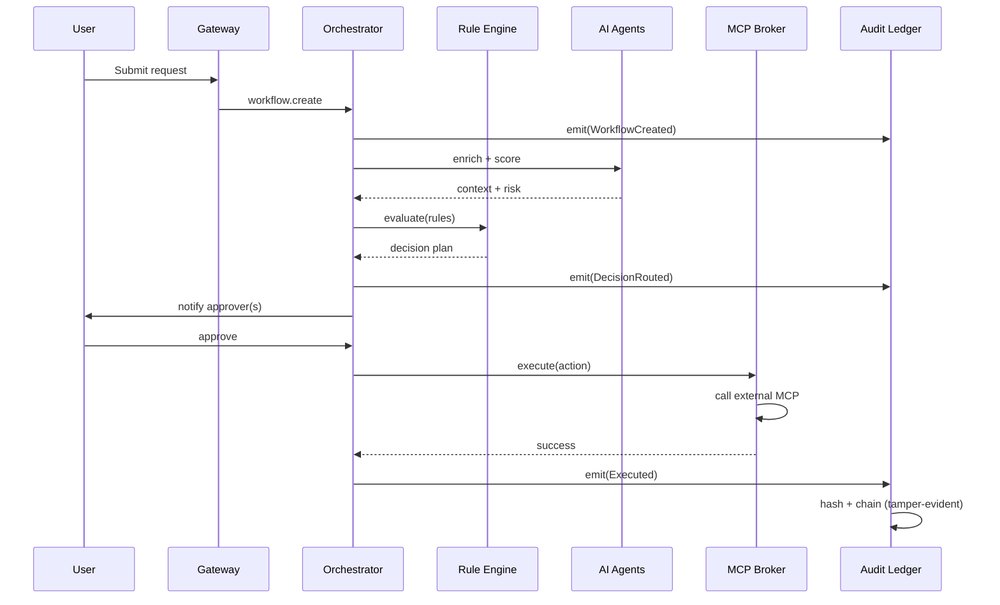

---

## 11. MCP Integration Mesh

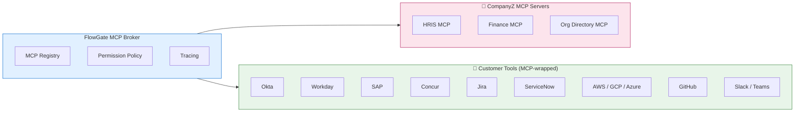

**Why MCP?**
- ⚡ Standardized adapter contract → integrations ship in days, not quarters
- 🔐 Per-tool permission scoping built in
- 🧩 Customers can register their own internal MCP servers → FlowGate becomes the action layer for *their* systems too

---

## 12. State Machine (per Approval Request)

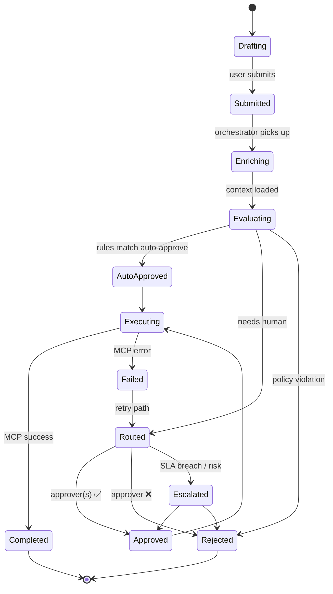

---

## 13. Personas

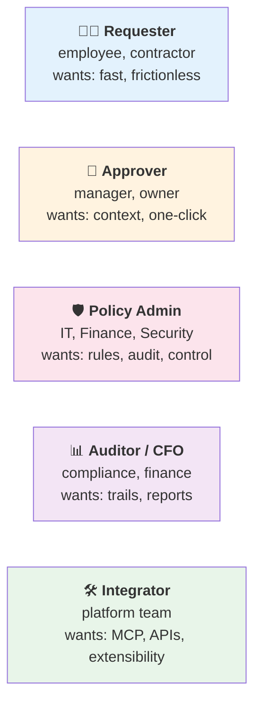

---

## 14. Differentiation Map

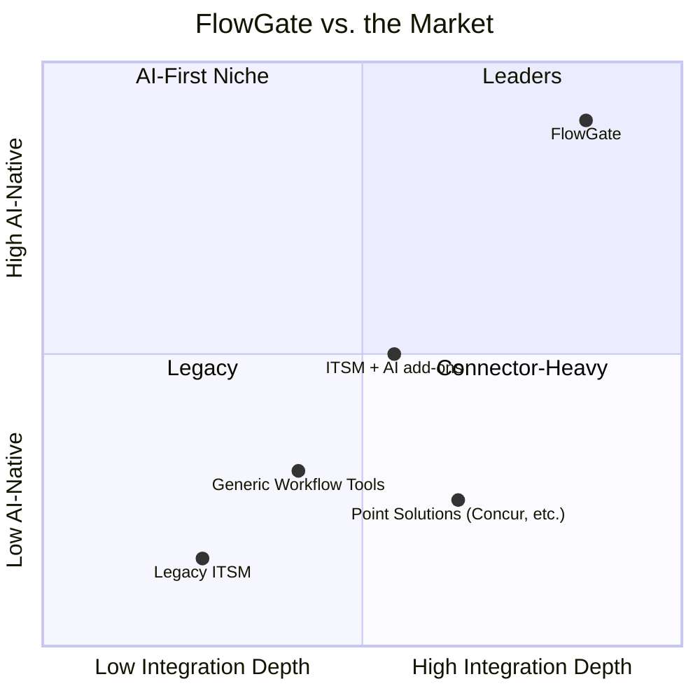

---

## 15. Phased Roadmap

```mermaid
gantt
    title FlowGate Roadmap (Indicative)
    dateFormat YYYY-MM-DD
    axisFormat %b %Y

    section Foundations
    Rule Engine + Form Generator     :done, f1, 2026-07-01, 90d
    First 2 Category Packs (IAM, Reimb) :f2, after f1, 60d

    section AI & MCP
    Copilot + Auto-Fill Agents       :a1, after f1, 75d
    MCP Broker + 5 connectors        :a2, after f1, 90d

    section Expansion
    Category Packs 3-8               :e1, after f2, 120d
    Customer-hosted MCP servers      :e2, after a2, 90d

    section GA
    Audit / Compliance / SOC2        :g1, after e1, 60d
    GA Launch                        :milestone, after g1, 1d
```

---

## 16. Success Metrics

```mermaid
flowchart LR
    subgraph N["📈 North Star"]
        NS["⏱️ Median time-to-decision<br/>< 1 hour"]
    end

    subgraph IN["Input Metrics"]
        I1[% requests auto-filled by AI]
        I2[% requests auto-approved by rules]
        I3[# MCP integrations live per tenant]
    end

    subgraph OUT["Outcome Metrics"]
        O1[Approver clicks per decision]
        O2[Policy violation rate ↓]
        O3[Audit findings ↓]
        O4[Customer NPS]
    end

    IN --> NS --> OUT

    style NS fill:#fff59d,stroke:#f57f17,stroke-width:2px
```

---

## 17. Risks & Mitigations

```mermaid
flowchart LR
    R1[🔥 Risk: AI hallucinates policy] --> M1[✅ Mitigation: rules are deterministic;<br/>AI only suggests, never decides]
    R2[🔥 Risk: MCP scope creep / blast radius] --> M2[✅ Per-action scoping +<br/>dry-run + TTL on all grants]
    R3[🔥 Risk: Customer change-management] --> M3[✅ Ship Category Packs +<br/>policy simulation sandbox]
    R4[🔥 Risk: Compliance / auditability] --> M4[✅ Immutable, hash-chained<br/>event ledger from day 1]

    style R1 fill:#ffcdd2
    style R2 fill:#ffcdd2
    style R3 fill:#ffcdd2
    style R4 fill:#ffcdd2
    style M1 fill:#c8e6c9
    style M2 fill:#c8e6c9
    style M3 fill:#c8e6c9
    style M4 fill:#c8e6c9
```

---

## 18. The Pitch in One Slide

```mermaid
flowchart TB
    T["<b>FlowGate</b><br/><i>The AI-native, MCP-connected approval platform</i>"]
    T --> A["⚙️ Rule Engine Pipeline<br/>policy-as-code, deterministic, auditable"]
    T --> B["📂 Category Packs<br/>IAM · Reimb · Travel · Expenses · Software · ..."]
    T --> C["📝 Auto-Generated Forms<br/>schema-driven, omni-channel"]
    T --> D["🤖 Native AI Agents<br/>copilot · autofill · auto-assign · risk · explain"]
    T --> E["🔌 MCP Integration Mesh<br/>CompanyZ + customer tools, standardized"]

    A --> WIN["🏆 <b>Outcome</b><br/>< 1hr median approvals · zero shadow workflows<br/>full audit trail · happy approvers"]
    B --> WIN
    C --> WIN
    D --> WIN
    E --> WIN

    style T fill:#1e88e5,color:#fff,stroke:#0d47a1,stroke-width:2px
    style WIN fill:#fff59d,stroke:#f57f17,stroke-width:2px
```

---

## 19. Open Questions for Design Partners

1. Which **3 category packs** should we ship first? (proposed: Cloud IAM, Reimbursements, Software Access)
2. How much **policy authoring** do customers want to do themselves vs. consume defaults?
3. What's the **MCP server inventory** in target accounts — what should we wrap first?
4. Where do customers draw the line between **AI suggesting** vs. **AI deciding**?
5. What does **regulated-industry deployment** (on-prem MCP broker, BYO-LLM) require?

---

*Document prepared by Product Management, CompanyZ · v0.1 · 2026-06-11*
